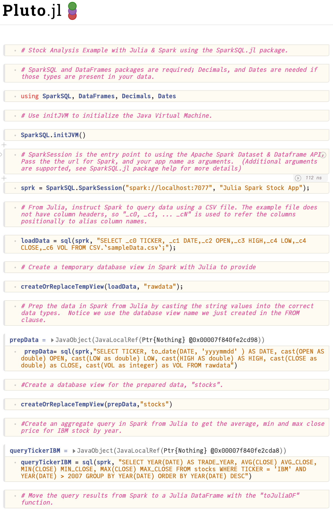
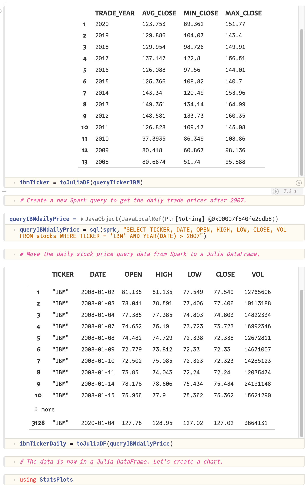
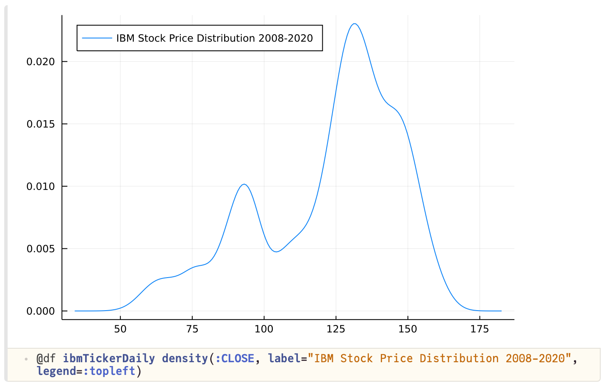
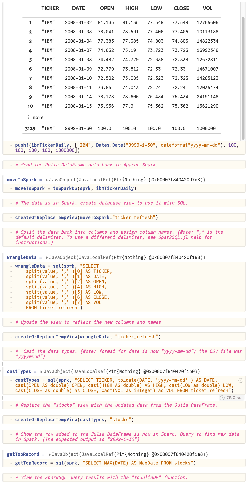
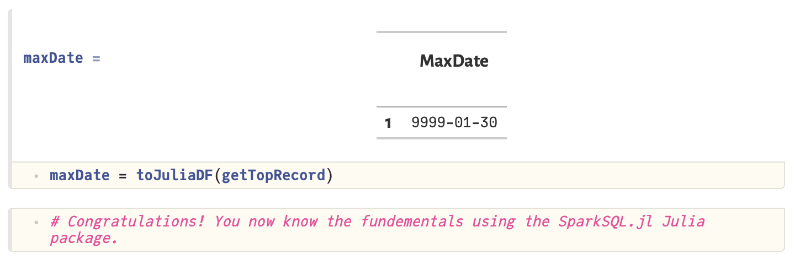

# SparkSQL.jl Blog

Welcome to the SparkSQL.jl Blog. This blog will teach Julia developers best practices for using the SparkSQL.jl package. The first tutorial is a Pluto Notebook containing code on how to perform the most essential SparkSQL.jl tasks.     

The official SparkSQL.jl project page is located here:
- https://github.com/propelledanalytics/SparkSQL.jl

The tutorial page for SparkSQL.jl is here:
- https://github.com/propelledanalytics/Tutorials

## SparkSQL.jl Tutorials 
The "Tutorials_SparkSQL" folder has the Julia Pluto notebook tutorials and sample data.
To run the notebook:
1. Install Apache Spark 3.1.1 or later: http://spark.apache.org/downloads.html
2. Install either OpenJDK 8 or 11: https://adoptopenjdk.net/
3. Setup your JAVA_HOME and SPARK_HOME enviroment variables: 
   - `export JAVA_HOME=/path/to/java` 
   - `export SPARK_HOME=/path/to/Apache/Spark`
4. Start Apache Spark (note using default values):
   - /path/to/Apache/Spark/sbin/start-master.sh
   - /path/to/Apache/Spark/sbin/start-worker.sh --master localhost:7070
5. Ensure your JAVA_HOME and SPARK_HOME are set and then start Julia:
   - `JULIA_COPY_STACKS=yes julia`
6. Install SparkSQL.jl along with other required Julia Packages:
   - `] add SparkSQL; add DataFrames; add Decimals; add Pluto;`
7. Launch the Pluto notebook:
   - `Using Pluto; Pluto.run();`
8. Download the tutorial Notebook and sample data from this repository. In Pluto, navigate to where you saved the tutorial notebook.
9. The notebook will run automatically. The code shows the commonly used features so you can use that as the basis of your SparkSQL.jl and Julia projects.

The output of the tutorial notebook is:

