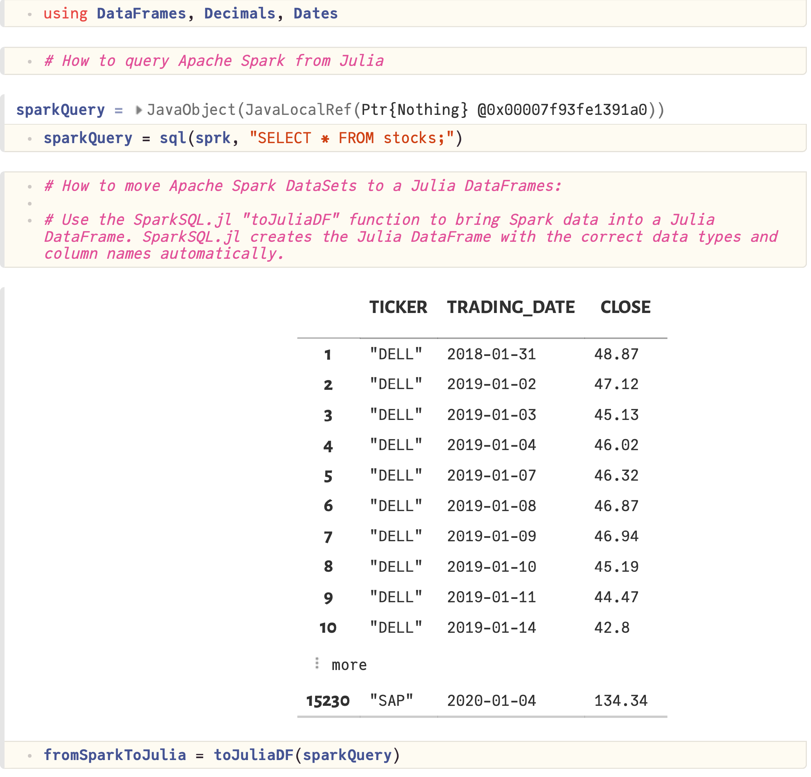

# SparkSQL.jl Blog

Welcome to the official SparkSQL.jl Blog. This blog teaches Julia developers best practices for using the SparkSQL.jl package. 


## Posts:

1. [Top 3 benefits of using the SparkSQL.jl Julia package](#top-3-benefits-of-using-the-sparksqljl-julia-package)

2. [Project links](#project-links)

3. [SparkSQL.jl and tutorials environment setup](#sparksqljl-and-tutorials-environment-setup)

### Releases:
4. [SparkSQL.jl release 1.4.0 announcement](#sparksqljl-release-140-announcement)

5. [SparkSQL.jl release 1.3.0 announcement](#sparksqljl-release-130-announcement)

6. [SparkSQL.jl release 1.2.0 announcement](#sparksqljl-release-120-announcement)

7. [SparkSQL.jl release 1.1.0 announcement](#sparksqljl-release-110-announcement)

8. [SparkSQL.jl release 1.0.0 announcement](#sparksqljl-release-100-announcement)

### Tutorials:
9. [Introduction to SparkSQL.jl tutorial](#introduction-to-sparksqljl-tutorial)

10. [Working with data tutorial](#working-with-data-tutorial)

11. [Machine learning with SparkSQL.jl tutorial](#machine-learning-with-sparksqljl-tutorial)

12. [Scaling compute on SparkSQL.jl tutorial](#scaling-compute-on-sparksqljl-tutorial)

## Top 3 benefits of using the SparkSQL.jl Julia package
SparkSQL.jl enables Julia programs to work with Apache Spark data using just SQL.  Here are the top 3 reasons to use Julia with Spark for data science:

1. Julia is a modern programming language that has state-of-the art data science packages and is much faster than Python.                           

2. Apache Spark is one of the world's most ubiquitous open-source big data processing platforms. SparkSQL.jl allows Julia programmers to create Spark applications in Julia.

3. Used together, Julia with Apache Spark forms the most advanced data science platform. SparkSQL.jl makes it happen.


## Project links

The official SparkSQL.jl project page is located here:
- [https://github.com/propelledanalytics/SparkSQL.jl](https://github.com/propelledanalytics/SparkSQL.jl)

The official tutorial page for SparkSQL.jl is here:
- [https://github.com/propelledanalytics/Tutorials](https://github.com/propelledanalytics/Tutorials)


## SparkSQL.jl and tutorials environment setup

The "Tutorials_SparkSQL" folder has the Julia Pluto notebook tutorials and sample data. To run the Pluto notebook tutorials, setup Apache Spark and your Julia environment:
### Install and Setup
1. Install Apache Spark 3.2.0 or later: [http://spark.apache.org/downloads.html](http://spark.apache.org/downloads.html)
2. Install either OpenJDK 8 or 11: 
   - [https://developer.ibm.com/languages/java/semeru-runtimes/downloads](https://developer.ibm.com/languages/java/semeru-runtimes/downloads) (OpenJ9)
   - [https://adoptium.net](https://adoptium.net)
3. Setup your JAVA_HOME and SPARK_HOME enviroment variables: 
   - `export JAVA_HOME=/path/to/java` 
   - `export SPARK_HOME=/path/to/Apache/Spark`
4. If using OpenJDK 11 on Linux set processReaperUseDefaultStackSize to true: 
    - `export _JAVA_OPTIONS='-Djdk.lang.processReaperUseDefaultStackSize=true'`
### Startup
5. Start Apache Spark (note using default values):
   - `/path/to/Apache/Spark/sbin/start-master.sh`
   - `/path/to/Apache/Spark/sbin/start-worker.sh --master localhost:7070`
6. Start Julia with "JULIA_COPY_STACKS=yes" required for JVM interop:
   - `JULIA_COPY_STACKS=yes julia`
7. If using Julia on MacOS start with "handle-signals=no": 
    - `JULIA_COPY_STACKS=yes julia --handle-signals=no`
8. Install SparkSQL.jl along with other required Julia Packages:
   - `] add SparkSQL; add DataFrames; add Decimals; add Dates; add Pluto;`
### Usage
9. Launch the Pluto notebook:
   - `Using Pluto; Pluto.run();`
10. Download the tutorial Notebooks and sample data from the [Tutorials_SparkSQL](https://github.com/propelledanalytics/Tutorials/tree/main/Tutorials_SparkSQL) repository. In Pluto, navigate to where you saved the tutorial notebooks.
11. The notebooks will run automatically. 

## SparkSQL.jl release 1.4.0 announcement
This post is announcing the release of SparkSQL.jl version 1.4.0. 

New features of this release are:
- Apache Spark 3.3.0 support.
- Julia version 1.8 support.

## SparkSQL.jl release 1.3.0 announcement

This post is announcing the release of SparkSQL.jl version 1.3.0. 

### About SparkSQL.jl
SparkSQL.jl is software that enables developers to use the Julia programming language with the Apache Spark data processing engine. 

Apache Spark is one of the world’s most ubiquitous open-source big data processing engines. Spark’s distributed processing power enables it to process very large datasets. Apache Spark runs on many platforms and hardware architectures including those used by large enterprise and government.

Released in 2012, Julia is a modern programming language ideally suited for data science and machine learning workloads. Expertly designed, Julia is a highly performant language. It sports multiple-dispatch, auto-differentiation and a rich ecosystem of packages.

### Use Case
Submits *Structured Query Language* (SQL), *Data Manipulation Language* (DML) and *Data Definition Language* (DDL) statements to Apache Spark.
Has functions to move data from Spark into Julia DataFrames and Julia DataFrame data into Spark. 

SparkSQL.jl delivers advanced features like dynamic horizontal autoscaling that scale compute nodes to match workload requirements (1). This package supports structured and semi-structured data in Data Lakes, Lakehouses (Delta Lake, Iceberg) on premise and in the cloud. To maximize java virtual machine performance, SparkSQL.jl brings support for the latest Java JDK-17 to Spark 3.2.0 (2). 

New features of this release are:

- Julia version 1.7 support.
- DataFrames 1.3.0 support. 

Install SparkSQL.jl via the Julia REPL:

```
] add SparkSQL
```
Update from earlier releases of SparkSQL.jl via the Julia REPL:
```
] update SparkSQL
update DataFrames
```

Example usage:
```
JuliaDataFrame = DataFrame(tickers = ["CRM", "IBM"])
onSpark = toSparkDS(sprk, JuliaDataFrame)
createOrReplaceTempView(onSpark, "julia_data")
query = sql(sprk, "SELECT * FROM spark_data WHERE TICKER IN (SELECT * FROM julia_data)")
results = toJuliaDF(query)
describe(results)
```

To learn more visit the Official Project Page:
- [https://github.com/propelledanalytics/SparkSQL.jl](https://github.com/propelledanalytics/SparkSQL.jl)

(1) The SparkSQL.jl compute node autoscaling feature is based on Kubernetes. For SparkSQL.jl on Kubernetes setup instructions see:
[SparkSQL.jl kubernetes readme](https://github.com/propelledanalytics/SparkSQL.jl/blob/main/kubernetes/README.md)

(2) JDK-17 support is provided as a podman container file: 
[Containerfile-JDK-17](https://github.com/propelledanalytics/SparkSQL.jl/blob/main/kubernetes/Containerfile-JDK-17)

## SparkSQL.jl release 1.2.0 announcement

This post is announcing the release of SparkSQL.jl version 1.2.0.

SparkSQL.jl is software that enables Julia programs to work with Apache Spark using just SQL.

Apache Spark is one of the world’s most ubiquitous open-source big data processing engines. Spark’s distributed processing power enables it to process very large datasets. Apache Spark runs on many platforms and hardware architectures including those used by large enterprise and government.

Released in 2012, Julia is a modern programming language ideally suited for data science and machine learning workloads. Expertly designed, Julia is a highly performant language. It sports multiple-dispatch, auto-differentiation and a rich ecosystem of packages.

SparkSQL.jl provides the functionality that enables using Apache Spark and Julia together for tabular data. With SparkSQL.jl, Julia takes the place of Python for data science and machine learning work on Spark.

New features of this release are:

- Kubernetes support.
- Apache Spark 3.2.0 support.
- JDK 17 support for Spark 3.2.0 on SparkSQL.jl kubernetes.

Install SparkSQL.jl via the Julia REPL:

```
] add SparkSQL
```
Update from earlier releases of SparkSQL.jl via the Julia REPL:
```
] update SparkSQL
update DataFrames
```

Example usage:
```
JuliaDataFrame = DataFrame(tickers = ["CRM", "IBM"])
onSpark = toSparkDS(sprk, JuliaDataFrame)
createOrReplaceTempView(onSpark, "julia_data")
query = sql(sprk, "SELECT * FROM spark_data WHERE TICKER IN (SELECT * FROM julia_data)")
results = toJuliaDF(query)
describe(results)
```
Official Project Page:
- [https://github.com/propelledanalytics/SparkSQL.jl](https://github.com/propelledanalytics/SparkSQL.jl)


## SparkSQL.jl release 1.1.0 announcement

This post is announcing the release of SparkSQL.jl version 1.1.0.

SparkSQL.jl is software that enables Julia programs to work with Apache Spark using just SQL.

Apache Spark is one of the world’s most ubiquitous open-source big data processing engines. Spark’s distributed processing power enables it to process very large datasets. Apache Spark runs on many platforms and hardware architectures including those used by large enterprise and government.

Released in 2012, Julia is a modern programming language ideally suited for data science and machine learning workloads. Expertly designed, Julia is a highly performant language. It sports multiple-dispatch, auto-differentiation and a rich ecosystem of packages.

SparkSQL.jl provides the functionality that enables using Apache Spark and Julia together for tabular data. With SparkSQL.jl, Julia takes the place of Python for data science and machine learning work on Spark.

New features of this release are:

- DataFrames 1.2.2 support
- A new progress meter that shows time elapsed and row count metrics. The progress meter provides visibility to processing status when moving larger datasets between Julia and Spark. 

Install SparkSQL.jl via the Julia REPL:

```
] add SparkSQL
```
Update from earlier releases of SparkSQL.jl via the Julia REPL:
```
] update SparkSQL
update DataFrames
```

Example usage:
```
JuliaDataFrame = DataFrame(tickers = ["CRM", "IBM"])
onSpark = toSparkDS(sprk, JuliaDataFrame)
createOrReplaceTempView(onSpark, "julia_data")
query = sql(sprk, "SELECT * FROM spark_data WHERE TICKER IN (SELECT * FROM julia_data)")
results = toJuliaDF(query)
describe(results)
```
Official Project Page:
- [https://github.com/propelledanalytics/SparkSQL.jl](https://github.com/propelledanalytics/SparkSQL.jl)


## SparkSQL.jl release 1.0.0 announcement

This post is announcing the availability of the SparkSQL.jl package.

SparkSQL.jl is an open-source software package that enables the Julia programming language to work with Apache Spark using just SQL and Julia.

Apache Spark is one of the world’s most ubiquitous open-source big data processing engines. Spark’s distributed processing power enables it to process very large datasets. Apache Spark runs on many platforms and hardware architectures including those used by large enterprise and government. By utilizing SparkSQL.jl, Julia can program Spark clusters running on:

- Enterprise: IBM POWER, z/Architecture (mainframe), x86, ARM, and SPARC
- HPC: POWER 9 with NVLINK and CAPI
- Cloud: Azure, AWS, Google GCP, IBM Cloud, and Oracle Cloud (OCI).

Released in 2012, Julia is a modern programming language ideally suited for data science and machine learning workloads. Expertly designed, Julia is a highly performant language. It sports multiple-dispatch, auto-differentiation and a rich ecosystem of packages.

SparkSQL.jl provides the functionality that enables using Apache Spark and Julia together for tabular data. With SparkSQL.jl, Julia takes the place of Python for data science and machine learning work on Spark. Apache Spark data science tooling that is free from the limitations of Python represents a substantial upgrade.

For decision makers, SparkSQL.jl is the safe choice in data science tooling modernization. Julia interoperates with Python. That means legacy code investments are protected while gaining new capabilities.

The SparkSQL.jl package is designed to support many advanced features including Delta Lake. Delta Lake architecture is a best practice for multi-petabyte and trillion+ row datasets. The focus on tabular data using SQL means the Spark RDD API is not supported.

You can install SparkSQL.jl via the Julia REPL:

```
] add SparkSQL
```
Example usage:

```
JuliaDataFrame = DataFrame(tickers = ["CRM", "IBM"])
onSpark = toSparkDS(sprk, JuliaDataFrame)
createOrReplaceTempView(onSpark, "julia_data")
query = sql(sprk, "SELECT * FROM spark_data WHERE TICKER IN (SELECT * FROM julia_data)")
results = toJuliaDF(query)
describe(results)
```
Official Project Page:
- [https://github.com/propelledanalytics/SparkSQL.jl](https://github.com/propelledanalytics/SparkSQL.jl)


## Introduction to SparkSQL.jl tutorial

The introduction to SparkSQL tutorial covers:
- How to submit a Julia application to Apache Spark using Julia.
- Load a CSV files in Spark using Julia
- Create database views in Spark using Julia
- Query Spark data using Julia
- Move Spark data into a Julia DataFrame
- Chart Spark data in Julia with StatsPlots
- Move Julia DataFrame data into Apache Spark 

Download the tutorial:
[Tutorial_00_SparkSQL_Notebook.jl](https://github.com/propelledanalytics/Tutorials/tree/main/Tutorials_SparkSQL/Tutorial_00_SparkSQL_Notebook.jl)


### Notebook output:


## Working with data tutorial

The working with data tutorial covers:
- Working with CSV files
- Casting (converting) data types from Text (String) to Dates and Numbers
- Writing files to disk in Parquet format
- Querying data in Spark using Julia
- Moving data from Spark to Julia DataFrames
- Creating Julia DataFrames and moving DataFrames to Apache Spark
- Using Spark and Julia DataFrame data together in SQL queries

Download the tutorial:
[Tutorial_01_Data_Notebook.jl](https://github.com/propelledanalytics/Tutorials/tree/main/Tutorials_SparkSQL/Tutorial_01_Data_Notebook.jl)

### Notebook output:




## Machine learning with SparkSQL.jl tutorial

The machine learning with SparkSQL tutorial covers:
- Using SparkSQL.jl to create training and test datasets
- Building a logistic regression machine learning model 
- Training and evaluating the model
- Using the model to make predictions


Download the tutorial:
[Tutorial_02_MachineLearning_Notebook.jl](https://github.com/propelledanalytics/Tutorials/tree/main/Tutorials_SparkSQL/Tutorial_02_MachineLearning_Notebook.jl)

### Notebook output:


## Scaling compute on SparkSQL.jl tutorial
Take the guess work out of big data performance tuning. SparkSQL.jl supports dynamic autoscaling that matches compute node size to your workload.  Ensure maximum performance at optimal cost by having the system scale worker nodes up and down to meet demand.


### Adjusting resource settings:
You set the maximum and minimum node sizes. Based on utilization, the system will autoscale within those parameters. Meet cost targets and service level agreement (SLA) requirements.

via YAML File:
```
kubectl apply -f spark-worker-hpa.yaml
```

via command line:

```
kubectl autoscale deployment spark-worker --min-1 --max=4 --cpu-percent=90
```


### Monitoring via the command line:
```
kubectl get deployments, hpa
```
or monitor continuously:
```
watch kubectl get deployments, hpa
```
